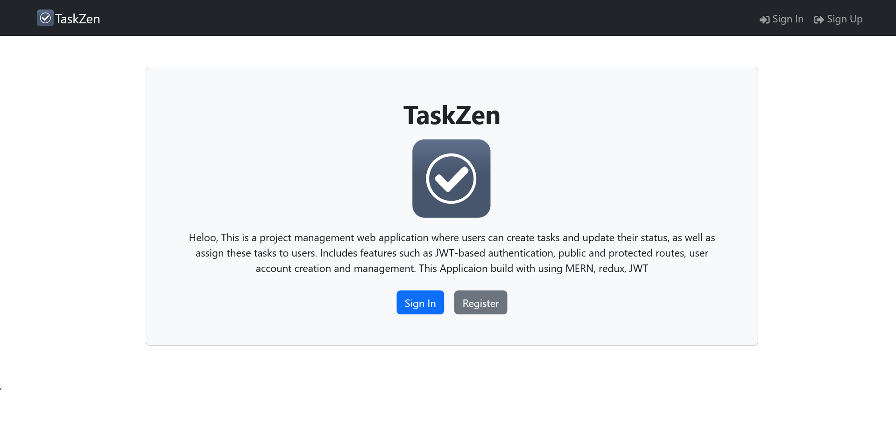
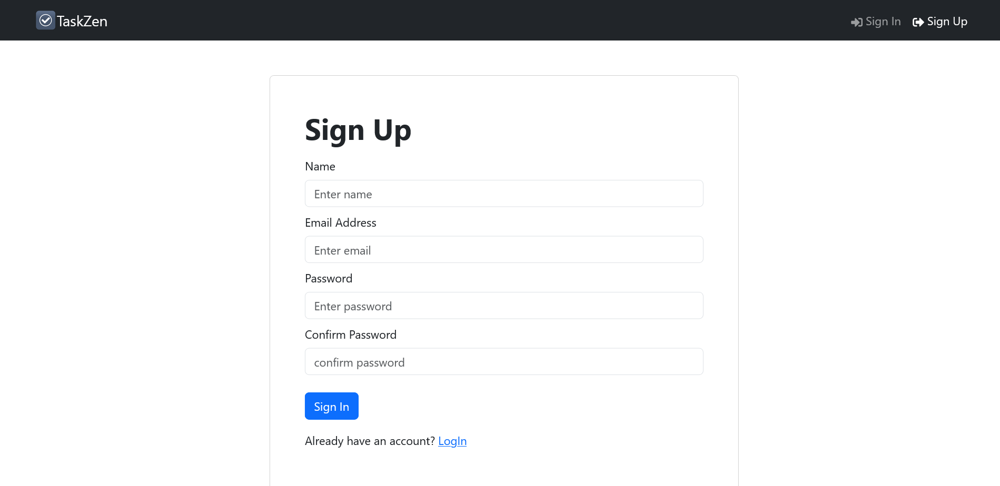
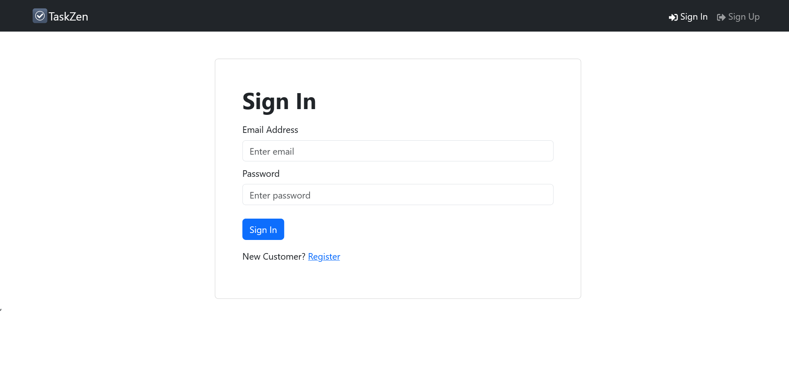
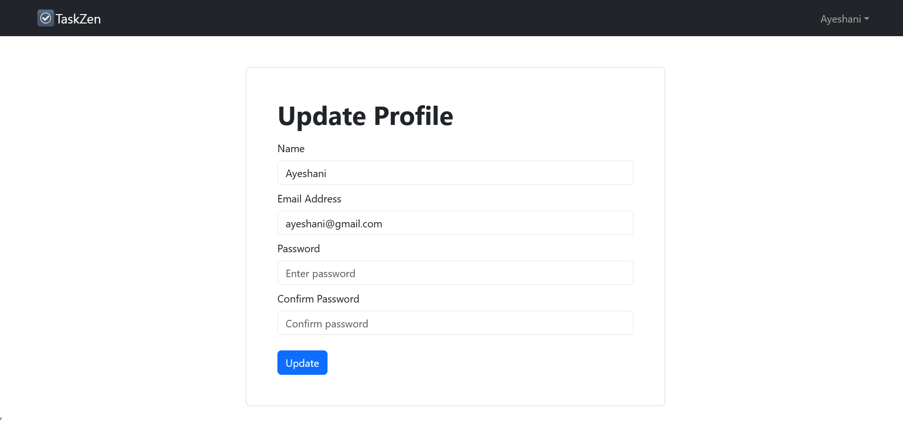
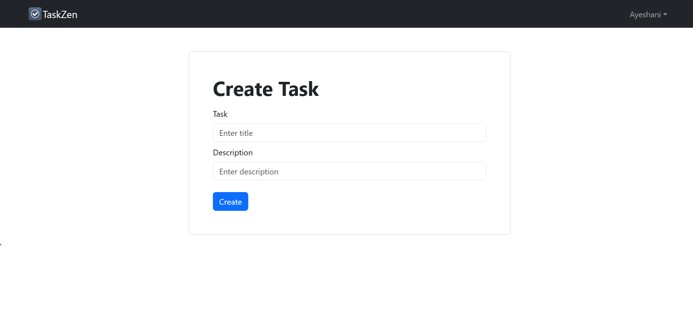
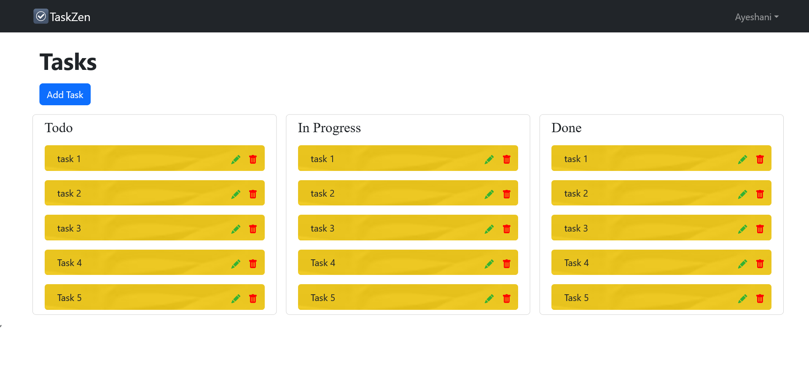

# TaskZen task management application
A project management web application where users can create tasks and update their status, as well as assign these tasks to users. Includes features such as JWT-based authentication, public and protected routes, user account creation and management.

## Backend

[Backend Link](https://github.com/Lakrandi-Ayeshani/Fitness_Assistance/tree/main/backend)

## Screenshots

### Home Page View

### Sign Up Page View

### Sign In Page View

### Update Profile Page View

### Create Task Page View

### Task Screen Page View

